<div align="center">

# LightCraft

### Your photos. Your pixels. Your machine.

**A fast, beautiful, open-source photo library and non-destructive raw developer — written from scratch in pure Rust.**<br>
Native on macOS, Windows and Linux. In the browser via WebAssembly. Drivable end-to-end by AI agents over MCP.

[Features](#edit-like-you-mean-it) · [Before & after](#before--after) · [Agents & MCP](#built-for-agents) · [Quick start](#quick-start) · [Roadmap](ROADMAP.md)

<br>

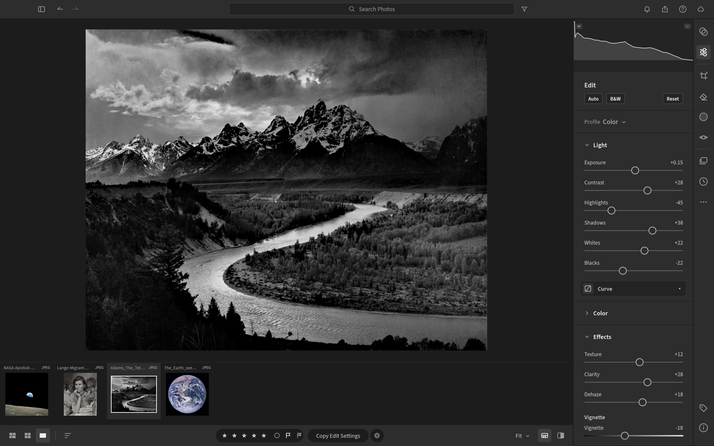

<sub><i>Ansel Adams, “The Tetons and the Snake River” (1942) — public domain, U.S. National Archives — developed in LightCraft.</i></sub>

</div>

<br>

## Edit like you mean it

LightCraft is a complete darkroom in a single native app. Every adjustment is **non-destructive** — your originals are
never touched — and every slider renders through a **scene-referred, wide-gamut, 32-bit float pipeline** so highlights
roll off like film, shadows open up without halos, and colour stays clean from capture to export.

<table>
<tr>
<td width="50%" valign="top">

### ☀️ Light
**Exposure, Contrast, Highlights, Shadows, Whites, Blacks** — with edge-aware local tone mapping (a guided filter on
log-luminance), so pulling −100 Highlights recovers a blown sky without the grey halos you'd get from a naive curve.

### 🎨 Color
**White balance** by temperature & tint (Kelvin for raw, relative for JPEG) with presets, Auto and a
click-to-neutralise **eyedropper**. **Vibrance** that protects skin tones, **Saturation**, an 8-band **Color Mixer**
(hue / saturation / luminance) and 3-way **Color Grading** wheels with blending and balance — all computed in OkLCh,
a modern perceptual colour space.

</td>
<td width="50%" valign="top">

### ✨ Effects
**Texture** for fine detail, **Clarity** for mid-tone punch, **Dehaze** (dark-channel-prior with guided refinement —
push it negative to add atmosphere), post-crop **Vignette** with highlight priority, roundness and feather, and
resolution-independent film **Grain** with size and roughness.

### 📈 Tone Curve
Parametric region curve with movable splits **plus** point curves for RGB, Red, Green and Blue. Curves are monotone by
construction — no accidental tone inversions, ever.

</td>
</tr>
</table>

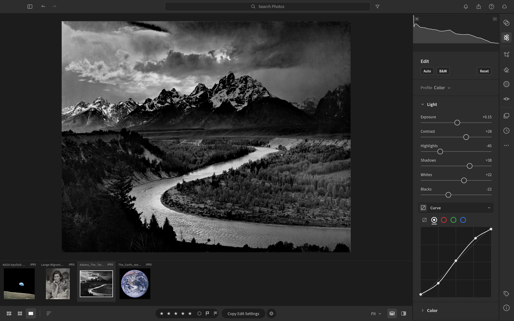

<br>

## Color grading, the cinematic way

Split-tone shadows, midtones and highlights independently with drag-anywhere colour wheels. Below, Dorothea Lange's
*Migrant Mother* gets a warm print-like tone — highlights at 42°, shadows at 28° — in two drags.

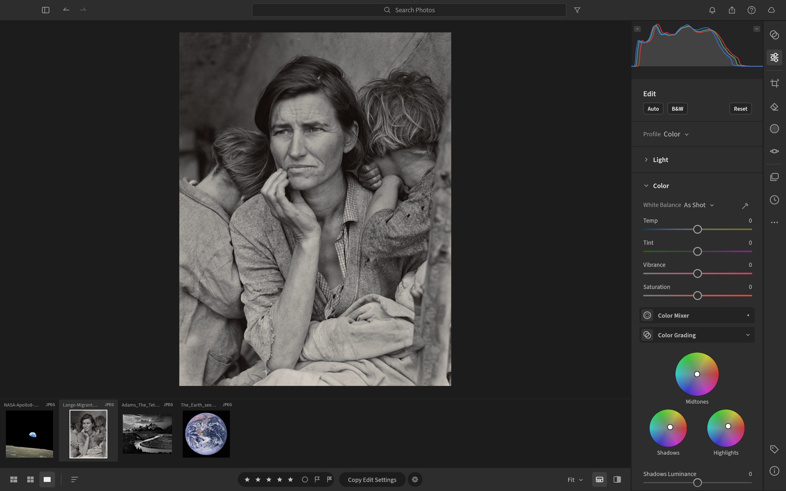

<sub><i>Dorothea Lange, “Migrant Mother” (1936) — public domain, Library of Congress.</i></sub>

<br>

## Before & after

Hold <kbd>\\</kbd> to peek at the original, press <kbd>Y</kbd> for side-by-side, or <kbd>Shift</kbd>+<kbd>Y</kbd> for a split view.
Every image below is a real screenshot of LightCraft, captured automatically by an agent through the
[control channel](#built-for-agents).

<table>
<tr>
<td width="50%">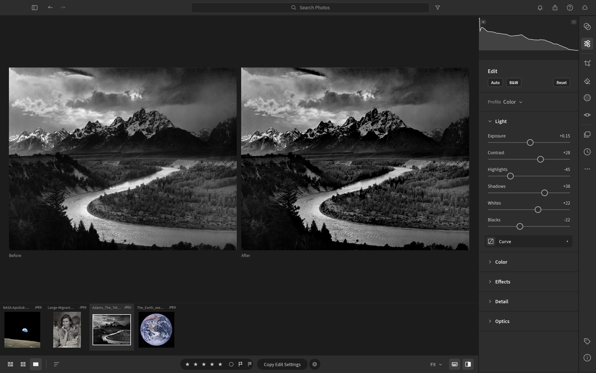<br><sub><b>The Tetons and the Snake River</b> — Highlights −45, Shadows +38, Clarity +28, Dehaze +18. <i>Ansel Adams, 1942 (public domain).</i></sub></td>
<td width="50%">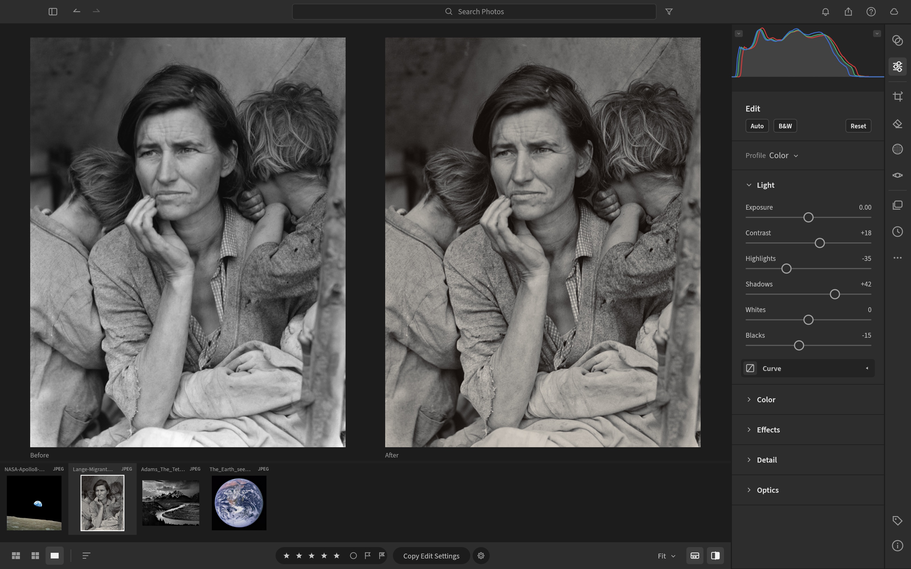<br><sub><b>Migrant Mother</b> — Shadows +42, Texture +18, split-toned grade, vignette. <i>Dorothea Lange, 1936 (public domain).</i></sub></td>
</tr>
<tr>
<td width="50%">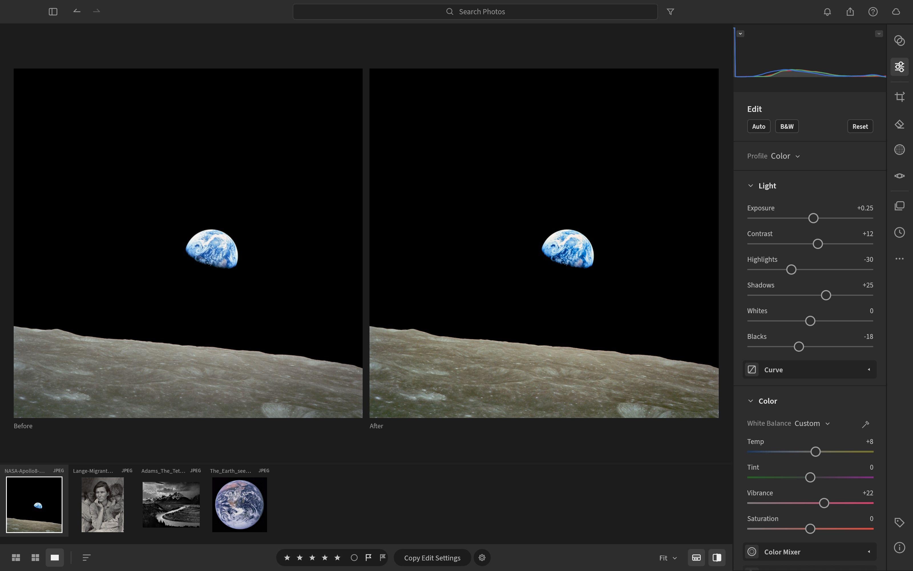<br><sub><b>Earthrise</b> — Dehaze +22, Highlights −30, warmer white balance, Vibrance +22. <i>NASA / Bill Anders, Apollo 8, 1968 (public domain).</i></sub></td>
<td width="50%">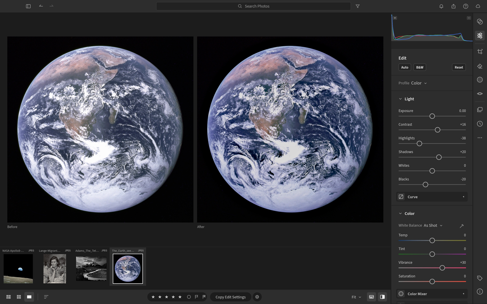<br><sub><b>The Blue Marble</b> — Highlights −38, Blacks −20, Dehaze +15, Vibrance +30. <i>NASA, Apollo 17, 1972 (public domain).</i></sub></td>
</tr>
</table>

<br>

## Masking that goes where you point

Paint with a **Brush** (size, feather, flow, density, erase), drop **Linear** and **Radial Gradients** with draggable
pins, or select by **Luminance Range**, **Color Range**, **Sky**, **Subject** and **Background**. Combine components
with **Add / Subtract / Intersect**, invert any of them, and dial in 15 local adjustments per mask — Temp, Tint,
Exposure, Contrast, Highlights, Shadows, Whites, Blacks, Texture, Clarity, Dehaze, Hue, Saturation, Sharpness, Noise —
plus an overall Amount.

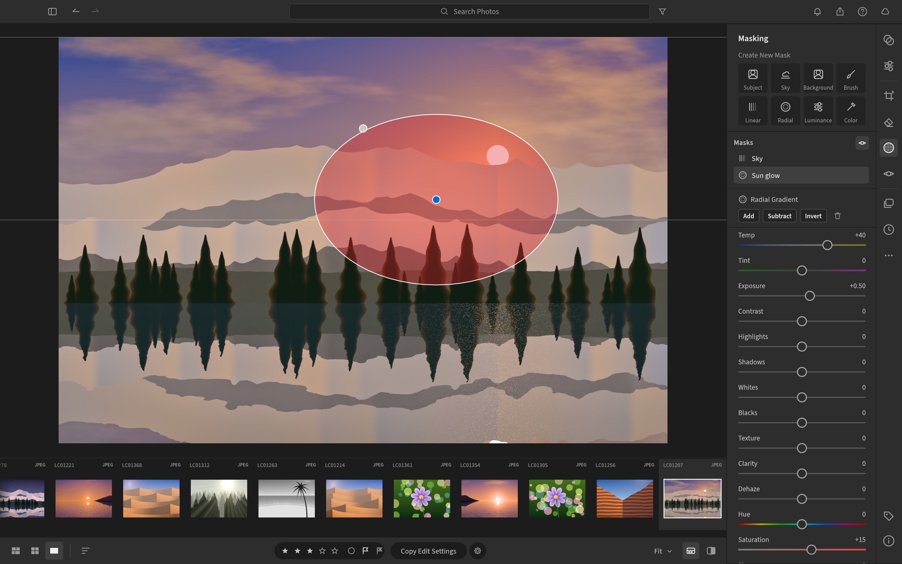

<br>

## Presets, profiles & the Color Mixer

Eighteen hand-built presets ship in the box — *Golden Hour, Teal & Orange, Faded Matte, Selenium Tone, Crisp
Landscape* and more — each with an **Amount** slider from 0 to 200 %. Save your own from any group of settings, mark
favourites, copy/paste or sync edits across a whole selection with exactly the groups you choose.

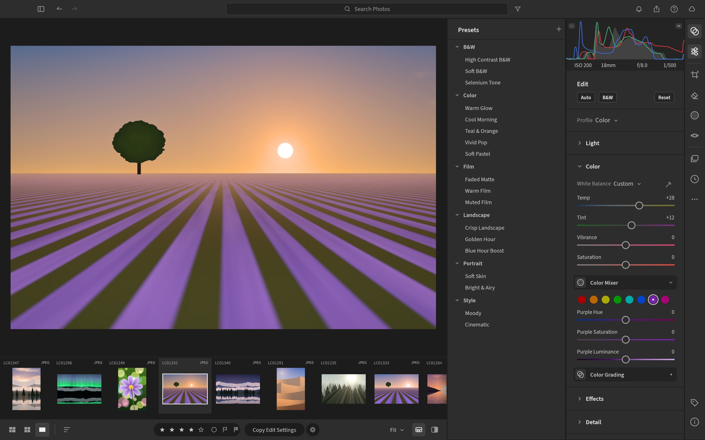

<table>
<tr>
<td width="50%" valign="top">

### ✂️ Crop, straighten & geometry
Free or locked aspect ratios (1:1, 4:5, 5:7, 2:3, 4:3, 16:9, 16:10, original), drag-to-rotate straightening that always
keeps the largest crop inside the image, thirds / grid / golden-ratio overlays, flips and 90° rotations, plus
manual Vertical, Horizontal, Rotate, Aspect, Scale and Offset transforms.

</td>
<td width="50%" valign="top">

### ⚫️ Black & White
One click (<kbd>V</kbd>) to monochrome with an 8-band **B&W Mix** that lets you darken skies or glow foliage — then
tone it with Color Grading for selenium, sepia or split-tone prints.

</td>
</tr>
<tr>
<td>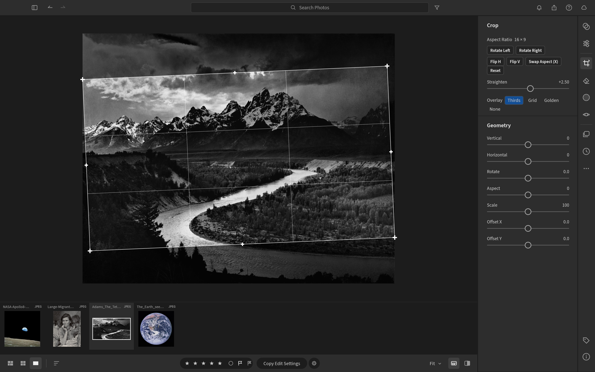</td>
<td>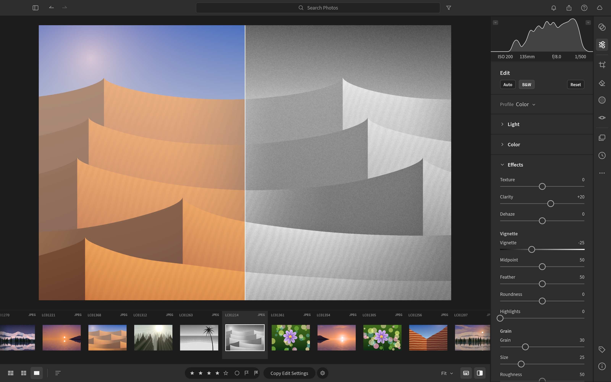</td>
</tr>
</table>

<br>

## Organize everything

A library that stays out of your way: **All Photos**, **Recently Added**, **Picks**, **By Date**, **Albums** nested in
**Folders**, and **Recently Deleted**. Rate with <kbd>0</kbd>–<kbd>5</kbd>, flag with <kbd>P</kbd> / <kbd>X</kbd> /
<kbd>U</kbd>, colour-label with <kbd>6</kbd>–<kbd>9</kbd>. Search understands fields —
`rating:>3 flag:pick iso:>800 camera:x2 date:2026-04 keyword:mountains` — and every view sorts by capture date,
import date, edit date, name, rating or size. Justified **Photo Grid** and **Square Grid** views are virtualized,
so they stay smooth whether you have forty photos or forty thousand.

<table>
<tr>
<td width="50%">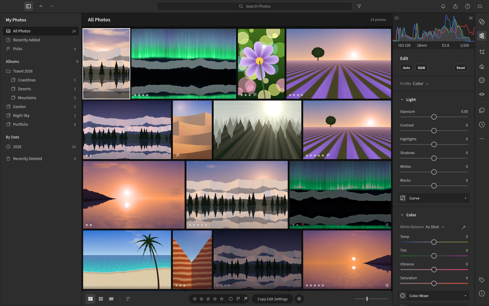</td>
<td width="50%">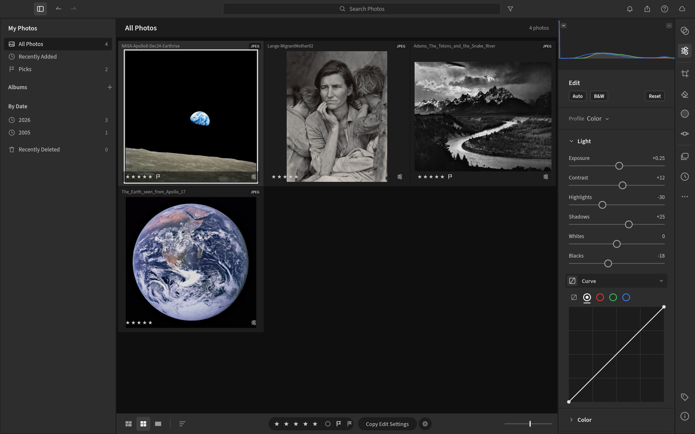</td>
</tr>
<tr>
<td colspan="2">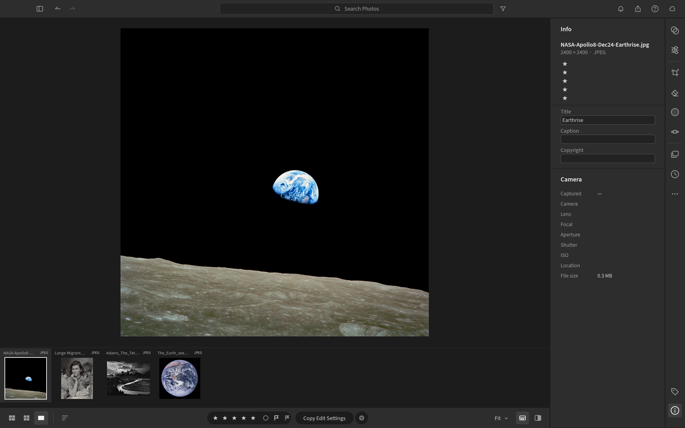</td>
</tr>
</table>

<br>

## Built for agents

Every menu item, slider, brush stroke, crop handle and keystroke in LightCraft is a **command** with a stable id and
JSON parameters — the UI, the keyboard, the CLI, a JSON-lines control channel and an **MCP server** all dispatch
through the same entry point. An agent can cull a shoot, develop it, mask a sky and export it — and *see* the result.

```sh
lightcraft --control 7980 ~/Pictures/trip
```
```jsonc
{"method": "engine.execute", "params": {"command": "photo.flag",  "params": {"flag": "pick"}}}
{"method": "engine.execute", "params": {"command": "develop.set", "params": {"values": {"light.highlights": -45, "light.shadows": 38}}}}
{"method": "engine.execute", "params": {"command": "mask.add",    "params": {"kind": "radial", "center": [0.62, 0.4], "rx": 0.2, "ry": 0.14}}}
{"method": "ui.clickWidget",   "params": {"id": "slider:effects.clarity"}}       // drive any widget by name
{"method": "ui.pointer",       "params": {"events": [{"kind":"down","x":0.2,"y":0.3}, {"kind":"up","x":0.4,"y":0.3}]}}
{"method": "ui.screenshot",    "params": {"path": "after.png"}}
```

- **91 engine commands** and **48 UI commands** — list them all with `engine.commands`, read every slider's range,
  default and current value with `develop.controls`.
- **MCP server** — `lightcraft-cli mcp` gives Claude (or any MCP client) ~100 tools: import, query, develop, mask,
  render (returned as an image), export — headless, or attached to the running app with screenshots, clicks and
  gestures. See [docs/mcp.md](docs/mcp.md).

  ```sh
  cargo build --release -p lightcraft-cli
  claude mcp add lightcraft -- "$PWD/target/release/lightcraft-cli" mcp ~/Pictures/shoot          # headless
  claude mcp add lightcraft-app -- "$PWD/target/release/lightcraft-cli" mcp --connect 127.0.0.1:7980  # live app
  ```
- **Scriptable CLI** — `lightcraft-cli render in.dng -o out.jpg --set light.exposure=0.7 --preset …`.
- **Undo for everything**, including agent actions: a slider drag (or a scripted burst of updates) is one undo step.
- **Every widget is addressable** (`ui.widgets`) and clickable by name, so agents can operate the real UI, not a
  side door.
- The screenshots in this README were produced by [`docs/showcase/`](docs/showcase/) scripts, end to end.
  Protocol reference: [docs/control-protocol.md](docs/control-protocol.md).

<br>

## Fast, native, private

- **Pure Rust, no C.** Our own RAW decoders (DNG with lossless JPEG, Canon CR2 — more on the way), our own colour
  science, our own pipeline. JPEG, PNG, TIFF, WebP, PSD composites and JPEG XL open today.
- **Scene-referred & wide-gamut.** Linear Rec.2020 float internally, Bradford-adapted white balance, gamut mapping
  instead of clipping, a filmic shoulder for raw and pixel-exact pass-through for JPEGs you haven't touched.
- **Resolution-independent edits.** Radii and brush sizes are relative to the image, so a 400 px preview, your
  5K display and a 60 MP export look the same.
- **Background rendering.** A worker pool renders the loupe, before/after and every visible thumbnail off the UI
  thread; drafts during drags, full quality on release.
- **Local-first.** No account, no cloud, no telemetry, no subscription. Your catalog is an append-only log of
  human-readable operations you can diff, back up or replay.

<br>

## Feature status

LightCraft is young and moving fast — see the [roadmap](ROADMAP.md) for estimates.

| Area | Status |
|---|---|
| Library: albums, folders, ratings, flags, labels, search, sort, grids, filmstrip | ✅ |
| Light, Color, Effects, Tone Curve, Color Mixer, Color Grading, B&W | ✅ |
| Masking: brush, linear, radial, luminance/colour range, add/subtract/intersect | ✅ (AI subject/sky use classical heuristics for now) |
| Crop, straighten, flip, rotate, aspect ratios, overlays | ✅ |
| Profiles (Color, Neutral, Vivid, Landscape, Portrait, Monochrome — our own looks), presets, versions, history, copy/paste/sync settings | ✅ |
| Control channel + every widget addressable | ✅ |
| RAW: DNG, CR2, ARW, NEF (uncompressed) | ✅ · compressed NEF, CR3, RAF, ORF, RW2, PEF… 🚧 |
| Detail: sharpening, luminance + colour noise reduction | ✅ · AI Denoise, Super Resolution ⬜ |
| Remove / Heal / Clone spots (auto source) | ✅ · content-aware fill (PatchMatch), Red Eye 🚧 |
| Export: JPEG / PNG / TIFF / WebP / AVIF, sizing, file-size limit, output sharpening, naming, batch, metadata policy, text watermark | ✅ · DNG export, image watermark ⬜ |
| Library persistence (crash-safe op log + snapshots), disk thumbnail cache, import with duplicate detection | ✅ |
| MCP server (headless or live app, persistent libraries), CLI, control channel | ✅ |
| Optics, Geometry/Upright, XMP sidecars, GPU pipeline | 🚧 |
| Web build (same UI in the browser via WASM; in-memory imports, export downloads) | ✅ · persistence, workers 🚧 |

<br>

## Quick start

```sh
git clone https://github.com/storytold/lightcraft && cd lightcraft
cargo run --release -p lightcraft                       # opens your library (~/Pictures/LightCraft Library; a new one starts with demo photos)
cargo run --release -p lightcraft -- ~/Pictures/trip    # import your photos (folders are scanned, duplicates skipped)
cargo run --release -p lightcraft -- --memory           # a throwaway in-memory demo session (writes nothing)
cargo run --release -p lightcraft -- --control 7980     # with the automation channel
cargo xtask web --serve                                 # the same app in the browser: http://127.0.0.1:8080/
cargo run --release -p lightcraft-cli -- render photo.jpg -o out.jpg --set light.exposure=0.5
cargo xtask ci                                          # fmt, clippy, tests, layering, wasm checks
```

The web build needs the `wasm32-unknown-unknown` target and the matching `wasm-bindgen` CLI
(`cargo xtask web` prints the exact install command); see [docs/web.md](docs/web.md).

Keyboard: <kbd>G</kbd> grid · <kbd>D</kbd> detail · <kbd>E</kbd> edit · <kbd>C</kbd> crop · <kbd>M</kbd> masking ·
<kbd>Shift</kbd>+<kbd>P</kbd> presets · <kbd>\\</kbd> original · <kbd>Y</kbd> before/after · <kbd>Z</kbd> zoom ·
<kbd>J</kbd> clipping · <kbd>⌘Z</kbd> undo · <kbd>⌘/</kbd> all shortcuts.

## How it's built

An engine-first Cargo workspace of small, tested crates with enforced layering (`cargo xtask layers`): `geom`,
`color`, `raster`, `tiff` → `raw`, `codecs`, `meta`, `develop` → `pipeline` → `catalog` → `engine` → `ui-egui`. The
egui frontend is one swappable crate; nothing below it knows a UI exists. `mcp` and the apps (`lightcraft`,
`lightcraft-cli`) sit on top of `engine`.

## Contributing

Humans and agents follow the same rules — read [AGENTS.md](AGENTS.md) first. The short version:

- **Clean-room.** Never read Adobe binaries or GPL raw/photo code (darktable, RawTherapee, LibRaw, rawspeed, dcraw…);
  work from public specs and black-box observation.
- **No Adobe assets, ever** — no icons, screenshots, presets, profiles, LUTs or fonts from Adobe products. Every
  image, icon and font in the repo is original, public domain, Creative Commons, OFL or permissively licensed, and has
  an entry in [assets/ATTRIBUTION.md](assets/ATTRIBUTION.md) added in the same commit.
- **Pure Rust**, enforced crate layering, everything is a command, and `cargo xtask ci` green before every commit
  (one task id per commit).

<br>

## Crafting Apps

Clean-room, pure-Rust creative tools from the same workshop — native on macOS, Windows and Linux, and in the browser.

<table>
  <tr>
    <td width="20%" valign="top"><a href="https://github.com/storytold/photocraft"><b>PhotoCraft</b></a><br><sub>Layered raster image editor — a Photoshop-class app with layers, masks, adjustments, brushes and PSD support.</sub></td>
    <td width="20%" valign="top"><a href="https://github.com/storytold/drawcraft"><b>DrawCraft</b></a><br><sub>Vector illustration — an Illustrator-class app with pen tools, live shapes, Pathfinder, type and SVG/PDF.</sub></td>
    <td width="20%" valign="top"><a href="https://github.com/storytold/filmcraft"><b>FilmCraft</b></a><br><sub>Non-linear video editor — a Premiere-class app with its own H.264/ProRes/AAC codecs, timeline and colour.</sub></td>
    <td width="20%" valign="top"><a href="https://github.com/storytold/lightcraft"><b>LightCraft</b></a><br><sub>Photo library and raw developer — a Lightroom-class app with a scene-referred pipeline, masking and presets.</sub></td>
    <td width="20%" valign="top"><a href="https://github.com/storytold/printcraft"><b>PrintCraft</b></a><br><sub>PDF viewer and editor — an Acrobat-class app for reading, organizing, annotating and editing PDFs.</sub></td>
  </tr>
</table>

## Credits

Showcase photographs are public-domain works, used via Wikimedia Commons: Ansel Adams, *The Tetons and the Snake River*
(1942, U.S. National Archives); Dorothea Lange, *Migrant Mother* (1936, Library of Congress); Bill Anders / NASA,
*Earthrise* (1968); NASA, *The Blue Marble* (1972). The demo library is procedurally generated by LightCraft. UI font:
Inter (SIL OFL). All icons are original. See [assets/ATTRIBUTION.md](assets/ATTRIBUTION.md).

LightCraft is an independent project and is not affiliated with or endorsed by Adobe. Licence: MIT OR Apache-2.0.
By the artcraft team.
